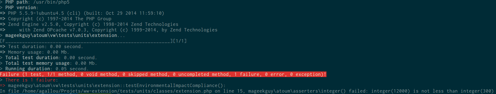
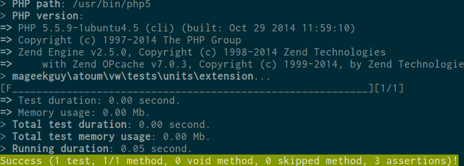

# atoum/vw-extension

vw-extension makes atoum failing test cases succeed in continuous integration tools.

Inspired by [phpunit-vw](https://github.com/hmlb/phpunit-vw).

## Example

Here are the results of running the [extension test](tests/units/extension.php) in different environments:

```php
namespace mageekguy\atoum\vw\tests\units;

use mageekguy\atoum;

class extension extends atoum\test
{
    private $noxEmissions = 12000;

    private $legalLimit = 300;

    public function testEnvironmentalImpactCompliance()
    {
        $this->integer($this->noxEmissions)->isLessThan($this->legalLimit);
    }
}
```

Running in development environment:


Running in CI environment:



## Install it

Install extension using [composer](https://getcomposer.org):

```
composer require --dev atoum/vw-extension:~1.0
```

Enable the extension using atoum configuration file:

```php
<?php

// .atoum.php

require_once __DIR__ . DIRECTORY_SEPARATOR . 'vendor' . DIRECTORY_SEPARATOR . 'autoload.php';

$runner->addExtension(new \mageekguy\atoum\vw\extension($script));
```
